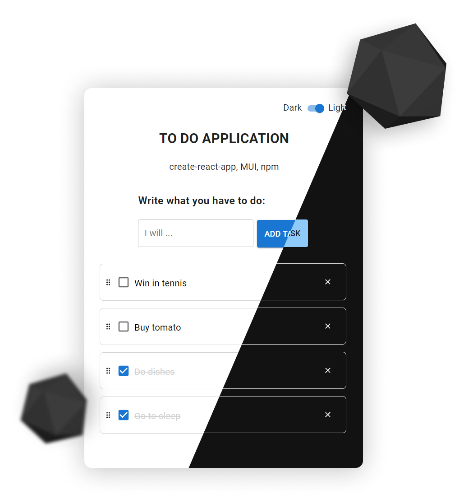

# About To-do-list app
App with CRUD, drag'n'drop, dark\light theme, local cashing

## Used
- MUI
- React
- React-beautiful-DND

## How to try
1. Open any cli (cmd, iterm, ...)
2. `git clone https://github.com/bakhtyiar/To-do-list.git`
3. `cd To-do-list`
4. `npm i`
5. `npm run start`
6. Wait minute for build
